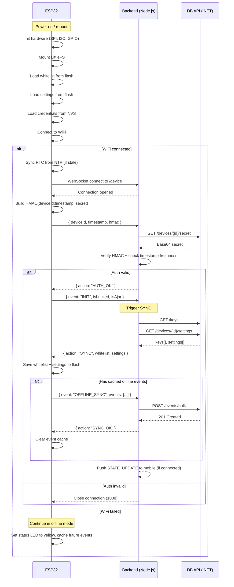
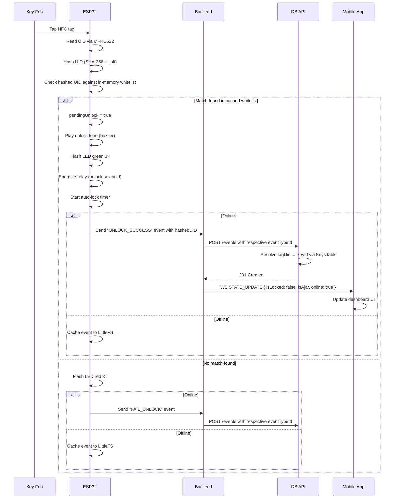
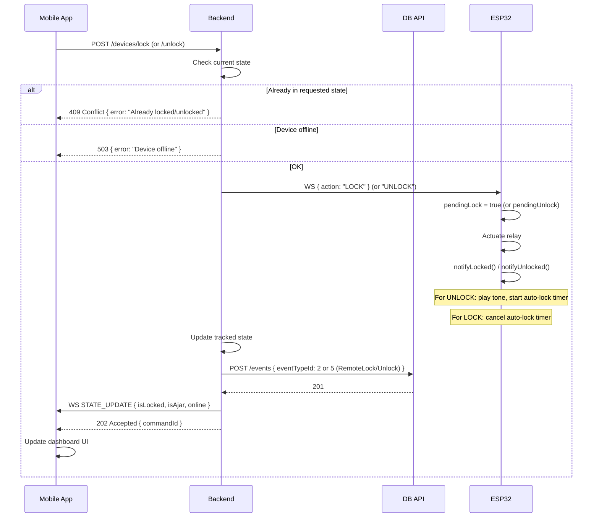

## Sequence Diagrams

### Smart lock boot

```mermaid
sequenceDiagram
    participant ESP as ESP32
    participant BE as Backend (Node.js)
    participant DB as DB API (.NET)

    Note over ESP: Power on / reboot
    ESP->>ESP: Init hardware (SPI, I2C, GPIO)
    ESP->>ESP: Mount LittleFS
    ESP->>ESP: Load whitelist from flash
    ESP->>ESP: Load settings from flash
    ESP->>ESP: Load credentials from NVS

    ESP->>ESP: Connect to WiFi
    alt WiFi connected
        ESP->>ESP: Sync RTC from NTP (if stale)
        ESP->>BE: WebSocket connect to /device
        BE-->>ESP: Connection opened

        ESP->>ESP: Build HMAC(deviceId:timestamp, secret)
        ESP->>BE: { deviceId, timestamp, hmac }

        BE->>DB: GET /devices/{id}/secret
        DB-->>BE: Base64 secret
        BE->>BE: Verify HMAC + check timestamp freshness

        alt Auth valid
            BE-->>ESP: { action: "AUTH_OK" }
            ESP->>BE: { event: "INIT", isLocked, isAjar }

            Note over BE: Trigger SYNC
            BE->>DB: GET /keys
            BE->>DB: GET /devices/{id}/settings
            DB-->>BE: keys[], settings[]
            BE-->>ESP: { action: "SYNC", whitelist, settings }
            ESP->>ESP: Save whitelist + settings to flash

            alt Has cached offline events
                ESP->>BE: { event: "OFFLINE_SYNC", events: [...] }
                BE->>DB: POST /events/bulk
                DB-->>BE: 201 Created
                BE-->>ESP: { action: "SYNC_OK" }
                ESP->>ESP: Clear event cache
            end

            BE-->>BE: Push STATE_UPDATE to mobile (if connected)
        else Auth invalid
            BE-->>ESP: Close connection (1008)
        end
    else WiFi failed
        Note over ESP: Continue in offline mode
        ESP->>ESP: Set status LED to yellow, cache future events
    end
```

### RFID Unlock

```mermaid
sequenceDiagram
    participant Fob as Key Fob
    participant ESP as ESP32
    participant BE as Backend
    participant DB as DB API
    participant App as Mobile App

    Fob->>ESP: Tap NFC tag
    ESP->>ESP: Read UID via MFRC522
    ESP->>ESP: Hash UID (SHA-256 + salt)
    ESP->>ESP: Check hashed UID against in-memory whitelist

    alt Match found in cached whitelist
        ESP->>ESP: pendingUnlock = true
        ESP->>ESP: Play unlock tone (buzzer)
        ESP->>ESP: Flash LED green 3×
        ESP->>ESP: Energize relay (unlock solenoid)
        ESP->>ESP: Start auto-lock timer

        alt Online
            ESP->>BE: Send "UNLOCK_SUCCESS" event with hashedUID
            BE->>DB: POST /events with respective eventTypeId
            DB->>DB: Resolve tagUid → keyId via Keys table
            DB-->>BE: 201 Created
            BE->>App: WS STATE_UPDATE { isLocked: false, isAjar, online: true }
            App->>App: Update dashboard UI
        else Offline
            ESP->>ESP: Cache event to LittleFS
        end
    else No match found
        ESP->>ESP: Flash LED red 3×

        alt Online
            ESP->>BE: Send "FAIL_UNLOCK" event
            BE->>DB: POST /events with respective eventTypeId
        else Offline
            ESP->>ESP: Cache event to LittleFS
        end
    end
```

### Remote Lock/Unlock from Mobile APP

```mermaid
sequenceDiagram
    participant App as Mobile App
    participant BE as Backend
    participant DB as DB API
    participant ESP as ESP32

    App->>BE: POST /devices/lock (or /unlock)

    BE->>BE: Check current state
    alt Already in requested state
        BE-->>App: 409 Conflict { error: "Already locked/unlocked" }
    else Device offline
        BE-->>App: 503 { error: "Device offline" }
    else OK
        BE->>ESP: WS { action: "LOCK" } (or "UNLOCK")

        ESP->>ESP: pendingLock = true (or pendingUnlock)
        ESP->>ESP: Actuate relay
        ESP->>ESP: notifyLocked() / notifyUnlocked()

        Note over ESP: For UNLOCK: play tone, start auto-lock timer
        Note over ESP: For LOCK: cancel auto-lock timer

        BE->>BE: Update tracked state
        BE->>DB: POST /events { eventTypeId: 2 or 5 (RemoteLock/Unlock) }
        DB-->>BE: 201

        BE->>App: WS STATE_UPDATE { isLocked, isAjar, online }
        BE-->>App: 202 Accepted { commandId }

        App->>App: Update dashboard UI
    end
```